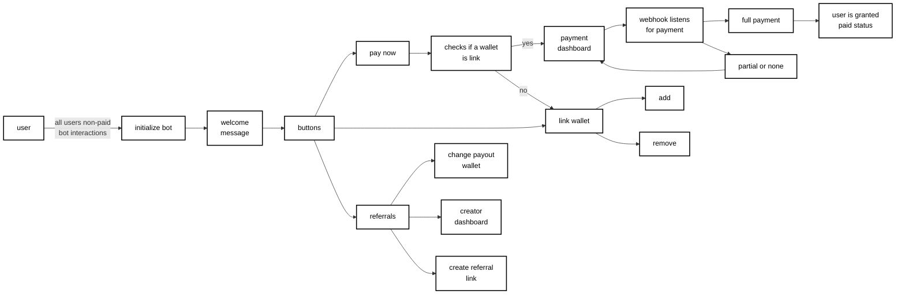
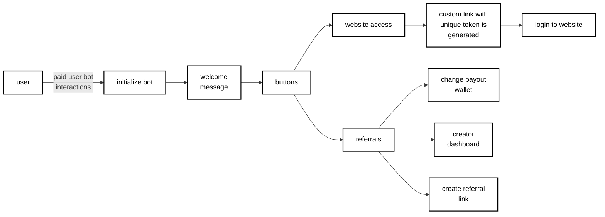

# Telegram Framework

## About

This is Telegram Framework centered around a bot that interacts with users via direct messages. The goal is to provide creators with a framework that handles payments, users, referrals, and private website sessions.

## Branch Info

*Documentation coming soon*

## Non-Paid Users Bot Interactions

## Paid Users Bot Interactions

## Framework Implementation Examples

Below are video demonstrations of the framework in action. These are example implementations and are not included in the base framework.

### Quick Links
- [View Referral System Demo](#referral-program)
- [View Payment System Demo](#payment-processing)

## Referral Program

The referral system provides creators with powerful tools to manage and grow their community:

- **Custom Creator Links**: Unique referral links for tracking and attribution
- **Creator Dashboard**: Real-time analytics and performance metrics
- **Automated Payouts**: Seamless commission distribution system

View Referral System Demo

## Payment Processing

Secure and efficient payment processing system featuring:

- **Solana Crypto Payments**: Fast and low-fee transactions
- **Secure Wallet Linking**: No signing required, maximum security
- **Automatic Payment Detection**: Real-time transaction monitoring
- **Comprehensive User Logging**: Complete payment history tracking

View Payment System Demo

## Documentation Quick Links

- [Full Documentation](#documentation)
- [Non-Paid User Flow](#non-paid-users-bot-interactions)
- [Paid User Flow](#paid-users-bot-interactions)

## Documentation

*Documentation coming soon*
